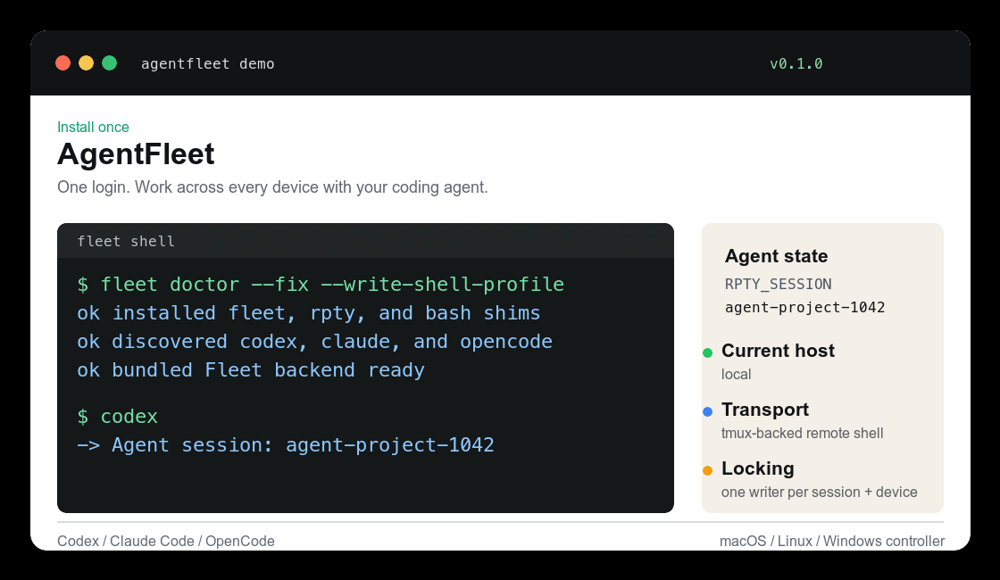

# Fleet PTY Router

[](https://www.rust-lang.org/)
[](#cross-platform)
[](#agent-workflow)
[](#license)

**One agent session. Work across every device in your fleet.**

Fleet PTY Router lets AI coding agents such as **Codex**, **Claude Code**, and
**OpenCode** move between real devices without losing shell state. It keeps the
existing Fleet CLI for inventory, SSH, transfer, jobs, WSL, and bootstrap, then
adds persistent remote `tmux` sessions for stateful agent work.



```bash
fleet doctor --fix --write-shell-profile
codex

fleet hosts
fleet use radxa
fleet run -- 'cd /tmp && export TARGET=radxa'
fleet use wsl2-local
fleet run -- 'hostname'
fleet run --host radxa -- 'echo "$PWD $TARGET"'
```

## Table Of Contents

- [Why](#why)
- [Key Features](#key-features)
- [Quickstart](#quickstart)
- [Installation](#installation)
- [Agent Workflow](#agent-workflow)
- [Device Modes](#device-modes)
- [Configuration](#configuration)
- [How It Works](#how-it-works)
- [State, Logs, And Locks](#state-logs-and-locks)
- [Cross-Platform](#cross-platform)
- [Validation](#validation)
- [Development](#development)
- [License](#license)

## Why

AI coding agents are good at using a shell, but device work is rarely one shell.
You may need a Jetson, a Raspberry Pi, a WSL2 box, a Windows host, and a cloud
machine in the same task.

Plain SSH is brittle for agents:

- `cd`, `export`, virtualenv activation, and prompt state disappear between
  commands.
- complex shell syntax gets re-quoted and sometimes misparsed.
- two agents can accidentally type into the same remote shell.
- long-running foreground work is hard to resume or inspect.

Fleet PTY Router gives each agent its own session and one remote `tmux` shell
per device. The agent can switch devices with `fleet use <device>` or run a
single command elsewhere with `fleet run --host <device> -- <cmd>`.

## Key Features

- **Direct agent entrypoints**: launch `codex`, `claude`, or `opencode`
  directly; the shim creates an isolated `RPTY_SESSION`.
- **Persistent remote shell state**: cwd, env vars, virtualenvs, and shell
  context survive across commands on each device.
- **Multi-device workflow**: one agent session can move between `radxa`,
  `wsl2-local`, Jetson, Raspberry Pi, cloud, and other Fleet devices.
- **Fleet-compatible CLI**: existing `fleet exec`, `push`, `pull`, `transfer`,
  `jobs`, `log`, `bootstrap`, `work-sync`, `wsl`, and `ssh` commands pass
  through unchanged.
- **Exact command payloads**: commands are uploaded and pasted through `tmux`
  buffers instead of being squeezed into fragile SSH quoting.
- **Session locks**: local locks prevent two processes from writing to the same
  `RPTY_SESSION + device` tmux pane at once.
- **Cross-platform controller**: macOS, Linux, and Windows controller support;
  Windows uses `.cmd` shims.
- **Clear Windows model**: native Windows targets use stateless `fleet exec`;
  persistent PTY on Windows machines goes through WSL2 devices.

## Quickstart

macOS/Linux:

```bash
# Download the matching archive from GitHub Releases, then:
tar -xzf pty-router-<platform>.tar.gz
cd pty-router-<platform>
./scripts/install.sh
```

Windows PowerShell:

```powershell
# Download the matching .zip from GitHub Releases, then:
Expand-Archive .\pty-router-windows-x86_64.zip
cd .\pty-router-windows-x86_64\pty-router-windows-x86_64
.\scripts\install.ps1
```

Open a new shell, then:

```bash
fleet doctor
codex       # or: claude, opencode
```

Inside the agent:

```bash
fleet hosts
fleet use <device>
fleet run -- 'pwd && hostname'
fleet env
```

## Installation

Recommended install uses the prebuilt GitHub Release artifact for your
platform. The install script uses the bundled binary and only falls back to
`cargo build` when no prebuilt binary is present.

Source install for developers:

```bash
cargo test
cargo build
cargo run --bin fleet -- doctor --fix --write-shell-profile
```

`doctor --fix --write-shell-profile` installs:

- `~/.rpty/bin/fleet-router`
- `fleet`, `rpty`, and `bash` command shims
- direct agent shims for discovered commands: `codex`, `claude`, `opencode`
- a shell profile PATH entry

If the current shell needs the PATH immediately:

```bash
export PATH="$HOME/.rpty/bin:$PATH"
```

PowerShell:

```powershell
$env:Path = "$HOME\.rpty\bin;$env:Path"
```

## Agent Workflow

Start the agent normally:

```bash
codex
claude
opencode
```

Then choose devices from inside the agent:

```bash
fleet hosts
fleet use radxa
fleet run -- 'cd /tmp && source .venv/bin/activate'
fleet run -- 'python run_step.py'

fleet use wsl2-local
fleet env
fleet run -- 'nvidia-smi || true'

fleet run --host radxa -- 'echo "one command back on radxa"'
```

Use:

- `fleet use <device>` to change the current target for this agent session.
- `fleet run -- <cmd>` for stateful commands on the current target.
- `fleet run --host <device> -- <cmd>` for one command on another device.
- `fleet env` before assuming cwd, shell, virtualenv, Python, or tmux state.
- `fleet cleanup [device]` when the remote PTY session should be destroyed.

## Device Modes

| Target | Recommended mode | Notes |
|---|---|---|
| Linux / Jetson / Raspberry Pi / cloud | `fleet run` | Requires remote `tmux`; preserves shell state |
| WSL2 | `fleet run` | Best persistent PTY path for Windows machines |
| Native Windows | `fleet exec` | Stateless PowerShell/cmd execution |
| Long non-interactive jobs | `fleet exec --detach` | Use `fleet jobs`, `fleet log`, `fleet kill-job` |
| File movement | `fleet push`, `fleet pull`, `fleet transfer`, `fleet work-sync` | Uses existing Fleet transfer behavior |
| Privileged work | `fleet exec --sudo` | Package managers, Docker, services, system paths |

Native Windows examples:

```bash
fleet exec home-win -- powershell -NoProfile -Command '$PSVersionTable.PSVersion'
fleet exec home-win -- cmd.exe /C echo ok
```

Persistent PTY on a Windows host should use its WSL2 Fleet device:

```bash
fleet use wsl2-local
fleet run -- 'cd /tmp && pwd'
```

## Configuration

Fleet backend is bundled with this project. The only required private file is
your device inventory:

```text
~/.rpty/bin/fleet_backend/devices.json
```

Create it from the example:

```bash
cp ~/.rpty/bin/fleet_backend/devices.example.json ~/.rpty/bin/fleet_backend/devices.json
chmod 600 ~/.rpty/bin/fleet_backend/devices.json
```

What stays outside the repo:

- real device hosts, usernames, ports, tags, and passwords in `devices.json`
- local shell profile state and agent binaries already installed on your machine

What ships with the project:

- Rust-native Fleet backend for inventory, status, match, exec, sudo exec,
  detached jobs, logs, kill-job, SFTP push/pull, single-file transfer, docker,
  bootstrap, scan, WSL gateway helpers, work-sync, and interactive ssh
- `bootstrap.sh`
- `devices.example.json`

Python is not required for normal Fleet use. The bundled Python backend remains
only as a legacy compatibility fallback for old `work-enter`/`work-monitor`
commands and for behavior comparisons. Set `RPTY_FLEET_NATIVE=0` to force that
fallback when debugging.

Use an existing external Fleet backend only if you want to override the bundled
one:

```bash
fleet config --fleet-py /path/to/fleet.py
fleet config --fleet-hub /path/to/hub
```

Add another agent command to automatic discovery:

```bash
fleet config --agent gemini
fleet doctor --fix
```

Router configuration is stored in:

```text
~/.rpty/config.toml
```

Environment variables still override config:

```bash
RPTY_FLEET_PY=/path/to/fleet.py
RPTY_FLEET_HUB=/path/to/hub
RPTY_SESSION=my-task
RPTY_BASH_PASSTHROUGH=1
```

## How It Works

`fleet run` does not send arbitrary agent commands as quoted SSH strings.

Instead it:

1. creates or reuses a remote `tmux` session named
   `rpty-<RPTY_SESSION>-<device>`;
2. writes the exact command payload to a local temp file;
3. uploads it with existing Fleet transfer behavior;
4. loads it into a remote `tmux` buffer;
5. pastes the buffer into the remote shell;
6. captures output and parses a unique exit marker.

This keeps command bytes intact and preserves shell state across agent steps.

Existing Fleet behavior remains the device-runtime contract:

```text
exec, exec --sudo, exec --literal, exec --stream, exec --detach,
jobs, log, kill-job, bootstrap, push, pull, transfer,
work-sync, work-enter, work-monitor, wsl
```

## State, Logs, And Locks

Raw tmux output is appended under:

```text
~/.rpty/state/sessions/<RPTY_SESSION>/logs/<device>.raw.log
```

Local locks are created before PTY writes:

```text
~/.rpty/state/sessions/<RPTY_SESSION>/locks/<device>.lock
```

If another live process owns the same lock, the command fails before typing into
the tmux pane. Parser failure is never treated as success; the raw log path is
kept for inspection.

## Cross-Platform

| Controller OS | Status | Install behavior |
|---|---|---|
| macOS | Verified | symlink shims, zsh/bash/fish profile support |
| Linux | Supported | symlink shims, zsh/bash/fish profile support |
| Windows | Verified | `.cmd` shims, PowerShell profile support |

Remote target support:

- Unix-like targets with `tmux`: persistent PTY mode.
- WSL2 targets: persistent PTY mode.
- Native Windows targets: stateless `fleet exec` with PowerShell/cmd.

## Validation

Validated on real Fleet devices:

- `radxa`: RK3588 Debian device, `tmux 3.3a`
- `wsl2-local`: WSL2 Ubuntu device on a Windows host, `tmux 3.4`
- `home-win`: native Windows stateless PowerShell/cmd execution

Verified behavior:

- persistent cwd/env state across commands;
- heredoc and complex shell characters survive routing;
- non-zero exit codes are surfaced;
- timeouts are explicit and do not kill the remote tmux session;
- locks prevent concurrent writes to the same session/device;
- direct agent shims work for Codex, Claude Code, and OpenCode;
- Windows controller builds and runs on `home-win`; native `exec`, `push`, and
  `pull` were verified against both Windows and WSL2/Linux targets.

More details: [docs/validation.md](docs/validation.md).

## Development

```bash
cargo fmt -- --check
cargo test
cargo check --target x86_64-pc-windows-gnu
```

Useful docs:

- [Getting started](docs/getting-started.md)
- [Architecture](docs/architecture.md)
- [Release and distribution](docs/release.md)
- [Fleet integration](docs/fleet-integration.md)

## Acknowledgements

Fleet PTY Router builds on the existing Fleet device workflow and the proven
`tmux` model for durable terminal sessions. Related projects that informed the
README and positioning include `tmate`, `sshx`, DevPod, and Coder.

## License

MIT. See [LICENSE](LICENSE).
